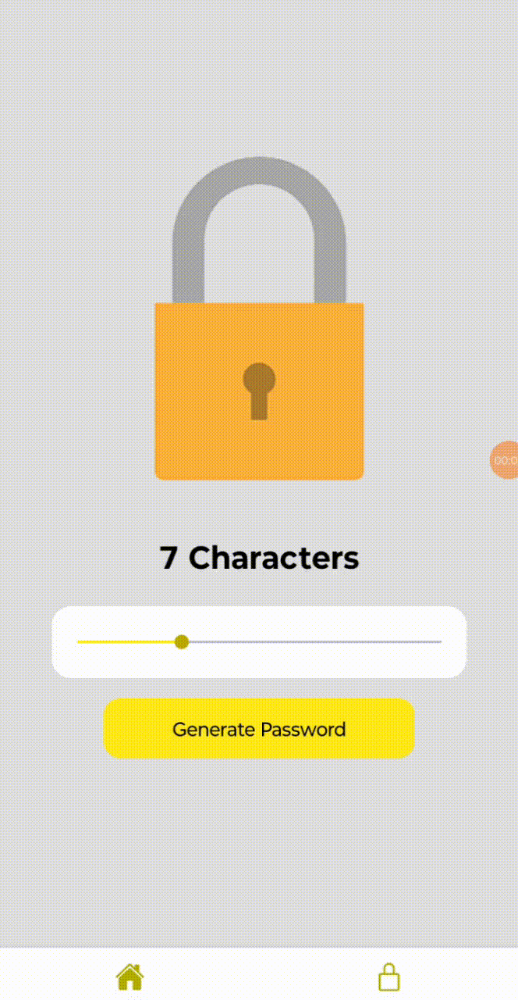

# Password Generator App

A professional React Native application that generates secure passwords based on user preferences. The user can control the number of characters in the password and customize the complexity (e.g., including numbers, special characters, and uppercase letters).



## Features

- Generate secure and random passwords.
- Customize the length of the password.
- Options to include/exclude:
  - Uppercase letters (A-Z)
  - Lowercase letters (a-z)
  - Numbers (0-9)
  - Special characters (!@#$%^&*)
- Copy the generated password to the clipboard.
- User-friendly interface with real-time updates.

## Screenshots

<!-- Include screenshots here -->

## Installation

To run the project locally, follow these steps:

### Prerequisites

- Node.js (version 14.x or higher)
- Expo CLI (if using Expo)
- React Native environment set up ([React Native CLI Quickstart](https://reactnative.dev/docs/environment-setup))

### Clone the repository

```bash
git clone https://github.com/your-username/password-generator-app.git
cd password-generator-app
